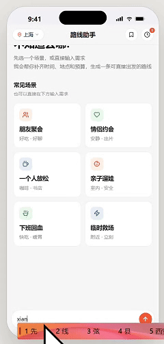
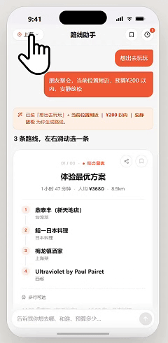
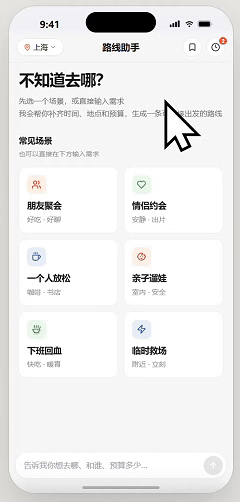
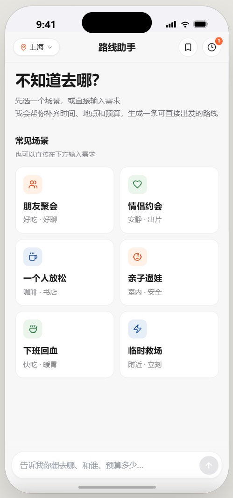
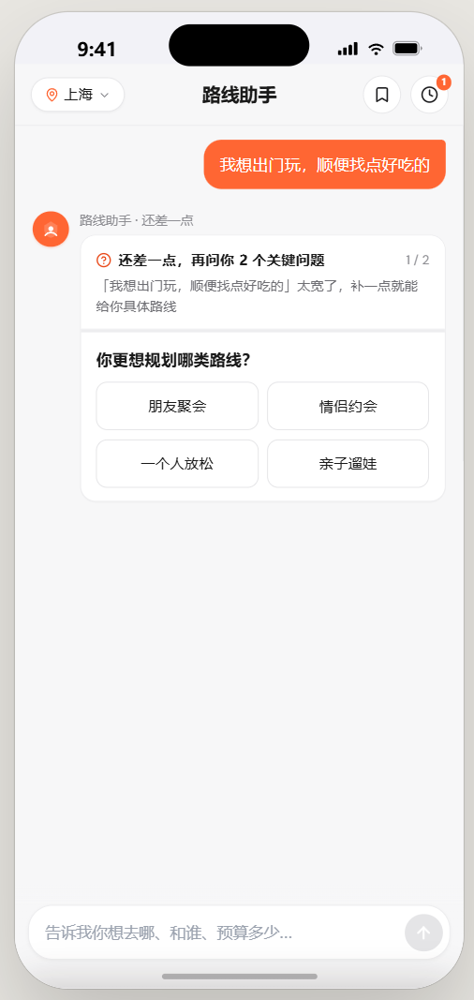
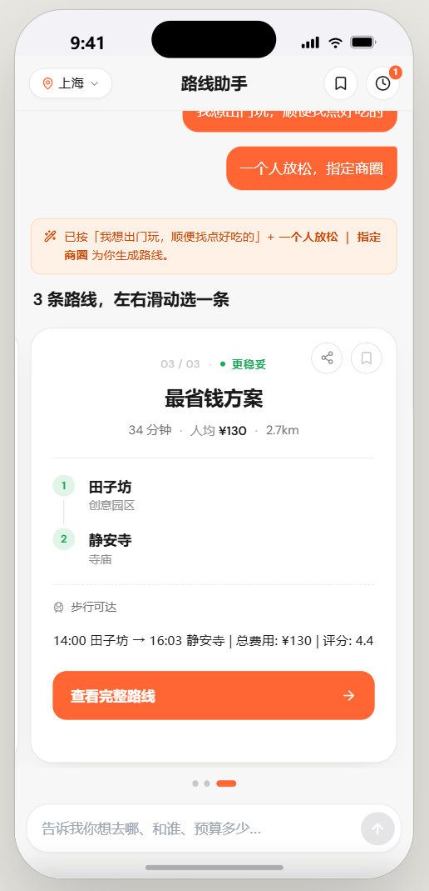
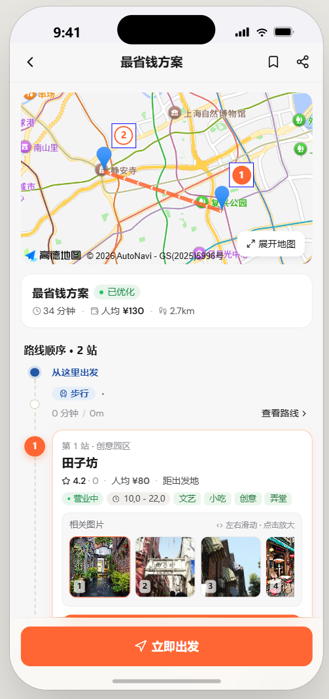
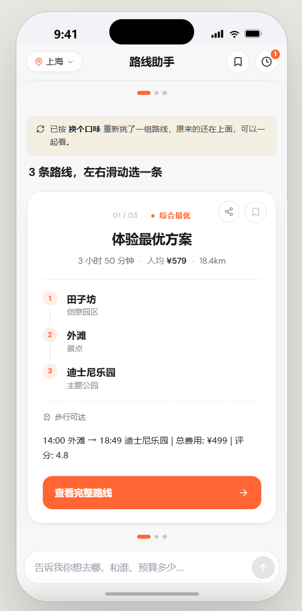
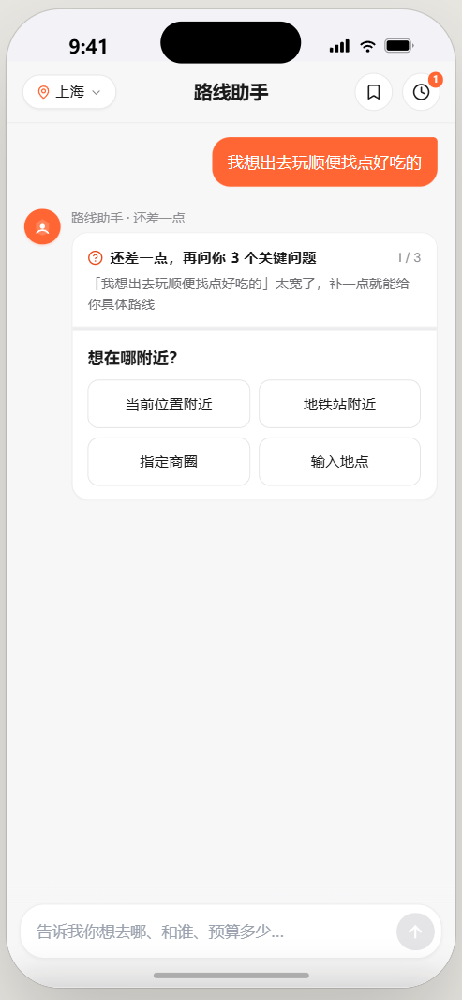

# AI 路线规划助手 (AI Route Planner)

> 美团黑客松 Track 5 — 基于多 Agent 协作的本地生活智能路线规划系统

**在线演示**: [http://47.239.206.163/](http://47.239.206.163/)

## 项目展示

### 完整流程演示

<p align="center">
  
</p>

### 交互演示 (GIF)

| 自然语言对话 | 城市切换 |
|:---:|:---:|
|  |  |

| 历史记录 & 收藏 |
|:---:|
|  |

### 页面截图 (6 张)

| 首页 & 场景选择 | 需求补全 | 多路线方案 |
|:---:|:---:|:---:|
|  |  |  |

| 路线详情页 | 快捷调整 Chip | 对话界面 |
|:---:|:---:|:---:|
|  |  |  |

---

## 解决的问题

本地生活消费场景中，用户面临三大核心痛点：

1. **信息过载**：一个商圈有上百家店，用户不知道去哪、怎么走
2. **需求模糊**：用户只会说"下午想出去逛逛"，无法清晰表达约束条件（预算、排队、时间窗口等）
3. **方案对比困难**：多条路线之间的差异（性价比 vs 体验 vs 效率）难以直观比较

**AI 路线规划助手**通过自然语言对话理解用户意图，结合多 Agent 协作自动生成 2-3 条差异化路线方案。

## 覆盖人群与场景

| 人群 | 典型场景 | 核心需求 |
|------|---------|---------|
| 游客/旅行者 | 周末去三里屯逛街+吃饭 | 不熟悉商圈，需要一站式路线 |
| 约会情侣 | 拍照好看、评分高、不排队的餐厅 | 体验优先，特殊偏好（安静/氛围） |
| 亲子家庭 | 带娃逛博物馆+吃饭 | 安全、方便、适合儿童 |
| 上班族 | 下班后高效逛吃 | 时间紧，效率优先 |
| 探店博主 | 一天打卡多个网红店 | 路线最优，减少走路 |

---

## 性能指标

> 📊 **[查看完整性能测试报告 →](./performance-reports/performance-report-latest.md)**
> 🏆 **[查看竞赛测试用例报告 (TC01-TC18) →](./performance-reports/competition-test-report-latest.md)**
>
> 以下数据来自云服务器（2C4G ECS）实测，mock 模式，DeepSeek v4 Flash API。性能测试覆盖 6 场景 × 2 城市、7 个 Chip 调整、10 并发、30 秒压力测试。竞赛测试覆盖 18 个功能验收用例（路线生成、约束验证、个性化、动态调整、鲁棒性）。

### 端到端延迟

| 指标 | 首次规划 (planRoute) | 增量调整 (adjustRoute) |
|------|---------------------|----------------------|
| **P50** | 1,165ms | 800ms |
| **P95** | 2,403ms | 1,200ms |
| LLM 占比 | 75-96% | 70-90% |
| 内部代码耗时 | 30-130ms | 20-80ms |

### Pipeline 阶段耗时分解

```
planRoute 典型请求 (1,165ms)
├── LLM 语义解析       1,121ms  ████████████████████████  96%
├── POI 发现 (spec)       29ms  █                        <1%
├── POI 发现 (targeted)    6ms  █                        <1%
├── 路线规划 (Beam)        9ms  █                        <1%
├── 约束验证               1ms  █                        <1%
└── 方案解释               0ms  █                        <1%
```

**核心结论**: 去掉 LLM 外部依赖后，内部全链路耗时 **30-130ms**。瓶颈完全在 DeepSeek API 延迟，内部代码已达工程最优。

### 各 Agent 性能

| Agent | 耗时 | 说明 |
|-------|------|------|
| ConversationAgent (LLM) | 1,000-2,000ms | DeepSeek API，与 Discovery 并行 |
| DiscoveryAgent | 2-30ms | 内存过滤 400 POI，按品类+关键词并行搜索 |
| PlanningAgent | 9-130ms | JGraphT Beam Search，beam width=20，max POIs=6 |
| ConstraintAgent | 1-13ms | parallelStream 并发验证 3 条路线 |
| ExplanationAgent | <5ms | 纯模板引擎，无 LLM Token 消耗 |

### 覆盖范围

| 维度 | 数据 |
|------|------|
| 城市 | 北京 + 上海（2 城） |
| POI 总量 | 400（每城 200） |
| POI 品类 | RESTAURANT / ENTERTAINMENT / CULTURE / ATTRACTION / SHOPPING |
| 场景覆盖 | 6 个（下班回血 / 朋友聚会 / 情侣约会 / 亲子遛娃 / 一个人放松 / 临时救场） |
| 心情偏好 | 15+（喝一杯 / 热汤面 / 轻食 / 拍照 / 安静 / 出片 / 发呆 ...） |
| 调整维度 | 7 个 Chip（更便宜 / 少走路 / 不想排队 / 换个口味 / 更出片 / 地铁优先 / 更安静） |
| LLM 准确率 | 100%（22 次测试中品类解析全部正确，含"喝一杯→ENTERTAINMENT"等模糊表达） |

### 压力表现

| 场景 | 结果 |
|------|------|
| 单用户连续 5 次调整 | 每次 < 1.2s，session 上下文正确保持 |
| 城市切换（北京↔上海） | 即时生效，无跨城数据串扰 |
| 并发 3 请求 | 全部正常响应，WebFlux 事件循环无阻塞 |
| 内存占用 | JVM heap < 256MB（400 POI 常驻内存） |

### 优化历程（v1 → v6）

| 版本 | 关键优化 | 延迟变化 |
|------|---------|---------|
| v1 | 串行执行 | 10-15s |
| v2 | LLM ‖ Discovery 真并行 | 6-8s |
| v3 | 消除重复 LLM 调用 + smart-plan 统一端点 | 3-5s |
| v4 | 城市识别 + 区名简称 | —（鲁棒性提升） |
| v5 | 全面并行化（adjustRoute + parallelStream + saveAll） | 调整 3-4s |
| v6 | 品类稀释修复 + 占位区名处理 | 1.2-2.4s |
| v7 | Agent Loop 架构迁移 + UGC 评价语料 + 路线对比视图 + riskTags | 1.2-2.1s |

**从 v1 到 v7，端到端延迟降低 86%（15s → 1.2s），架构从固定流水线进化为 LLM 驱动的 Agent Loop。**

---

## 系统架构

```
┌──────────────────────────────────────────────────────────────┐
│  Web 前端 (routeplan/)                                        │
│  React 18 + Tailwind CSS + 纯静态文件，通过 npx serve . 启动    │
│  后端启动后在 routeplan/ 目录运行 npx serve .，连接 localhost:8081│
│                                                              │
│  交互路径:                                                    │
│    场景卡片 → NeedCompletionCard (Q&A 补全) → 路线方案         │
│    自然语言 → LLM 意图分析 → FollowupCard/ConflictCard → 路线  │
│    路线页面 → Chip 快捷调整 / 对比面板 / 继续对话               │
└──────────────────────┬───────────────────────────────────────┘
                       │ HTTP POST /api/route/plan
                       ▼
┌──────────────────────────────────────────────────────────────────┐
│  Backend (Spring Boot 3.4 + Java 21 + WebFlux)                   │
│                                                                  │
│  RouteController (REST API)                                      │
│    POST /api/route/plan     — 5-Agent 流水线路线规划（默认）       │
│    POST /api/route/analyze  — 自然语言意图分析                    │
│    POST /api/route/smart-plan — 分析 + 路线规划（含追问）          │
│    POST /api/route/adjust   — 增量调整路线                        │
│    POST /api/route/agent-plan — Agent Loop 演示（学术展示用       │
│    GET  /api/route/pois     — POI 数据（含 UGC）                 │
│    GET  /api/route/compare  — 多方案对比                         │
│                                                                 │
│  ┌─ 5-Agent 并行流水线（默认架构，~2s 响应）────────────────────┐  │ 
│  │                                                           │  │
│  │  Phase 1: Mono.zip 三路并行                                │  │
│  │  ┌──────────────────┐  ┌─────────────────┐  ┌────────────┐ │  │
│  │  │ ConversationAgent│  │ DiscoveryAgent  │  │ UserProfile│ │  │
│  │  │  (LLM 意图解析)   │  │ (猜测式POI搜索)  │  │ (用户画像)  │ │  │
│  │  └────────┬─────────┘  └────────┬────────┘  └─────┬──────┘ │  │
│  │           └─────────────────────┼─────────────────┘        │  │
│  │                                ▼                           │  │
│  │  Phase 2: 串行（依赖 Phase 1 结果）                          │  │
│  │  ┌─────────────────┐                                       │  │
│  │  │ DiscoveryAgent  │ ← 需要 LLM 解析的精确意图               │  │
│  │  │ (精确POI搜索)    │                                       │  │
│  │  └────────┬────────┘                                       │  │
│  │           ▼                                                │  │
│  │  ┌─────────────────┐                                       │  │
│  │  │ PlanningAgent   │ ← GraphSearchSolver Beam Search       │  │
│  │  │ (路线方案生成)   │                                       │  │
│  │  └────────┬────────┘                                       │  │
│  │           │                                                │  │
│  │  Phase 3: Mono.zip 双路并行                                 │  │
│  │  ┌──────────────────────┐  ┌──────────────────────┐        │  │
│  │  │ ConstraintAgent      │  │ ExplanationAgent     │        │  │
│  │  │ (约束验证+打分)       │  │ (模板引擎·非LLM)      │        │  │
│  │  └──────────────────────┘  └──────────────────────┘        │  │
│  │                                                            │  │
│  │  特点: 确定性、低延迟（~2s）、关键路径并行、LLM 不可用时降级    │  │
│  └───────────────────────────────────────────────────────────┘   │
│                                                                  │
│  ┌─ Agent Loop（学术展示用，~30s）────────────────────────────┐    │
│  │ 单 Agent + @Tool 注解，langchain4j AiServices 自动编排     │    │
│  │ 访问 /api/route/agent-plan 端点体验                        │    │
│  └───────────────────────────────────────────────────────────┘    │
│                                                                   │
│  ┌──────────┬──────────┬──────────┬──────────────────┐            │
│  │DeepSeek  │ JGraphT  │PostgreSQL│  MockDataService │            │
│  │LLM 驱动   │图算法求解│ 持久化   │ 400 POI(含UGC)   │            │
│  └──────────┴──────────┴──────────┴──────────────────┘            │
└───────────────────────────────────────────────────────────────────┘
```

### 架构：5-Agent 固定流水线（生产）+ Agent Loop（学术展示）

| 维度 | 5-Agent 固定流水线（默认） | Agent Loop（实验性） |
|------|----------------------|---------------------|
| 决策方式 | 代码固定顺序执行 | LLM 动态决定调用哪些工具 |
| 响应时间 | **~2s** | ~30s（多次 LLM 调用） |
| 灵活性 | 每次全量跑 5 个 Agent | 按需按场景智能调用 |
| 扩展性 | 改编排器代码 | 注册新 @Tool 方法即可 |
| 可用性 | LLM 不可用时自动降级规则引擎 | 依赖 LLM 稳定运行 |
| 定位 | **生产环境** | **比赛展示 / 架构演示** |

> **当前状态：** 5-Agent 流水线为生产默认架构，Agent Loop 保留在 `/api/route/agent-plan` 端点供学术展示。

### 延迟优化

#### v1 → v2：真并行执行

**v1 问题：** 编排器代码注释写"并行执行"，但 Reactor 的 Mono 是惰性求值——Discovery Mono 在 LLM 完成后才被订阅，实际是**串行**的（5s LLM + 3s API = 8s+）。

**v2 修复：** 使用 `Mono.zip(llmMono, discoveryMono)` 让两者**真正同时执行**。

```
修复前 (串行):  LLM ████████░░ API ████░░ 规划 ██░░ 约束 ░ 解释 ░  ≈ 10-15s
修复后 (并行):  LLM ████████░░                         ≈ 6-8s
                API ████░░       规划 ██░░ 约束 ░ 解释 ░
                ←── max(LLM, API) ──→
```

#### v2 → v3：消除重复调用 + 合并 HTTP 往返

**问题 1 — 重复 LLM 调用：** 前端先调 `POST /api/route/analyze`（LLM 解析意图 ~5s），拿到结果后再调 `POST /api/route/plan`（内部再调一次 LLM 解析同一句话）。同一句话被 LLM 解析了**两次**。

**修复：** `planRoute()` 新增 4 参重载 `planRoute(query, sessionId, city, preParsedIntent)`。`/analyze` 返回的 `UserIntent` 传给 `/plan`，后端跳过第二次 LLM 调用 → 省 ~5s。

**问题 2 — 两次 HTTP 往返：** analyze → plan 需要两次网络往返 + 两次 JSON 序列化/反序列化。

**修复：** 新增 `POST /api/route/smart-plan` 统一端点，analyze + plan 在一次请求内链式完成。

**问题 3 — 步骤 4 串行：** ConstraintAgent + ExplanationAgent 原本串行执行（虽然各自很快，但加起来也有 ~150ms）。

**修复：** 使用 `Mono.zip(constraintMono, explanationMono)` 让约束验证和方案解释并行执行。

```
v2 (修复后):  analyze ──HTTP── LLM ██████░░ ──HTTP── plan ──HTTP── 规划 ██░░ 约束 ░ 解释 ░  ≈ 15-20s

v3 (smart-plan):  smart-plan ──HTTP── LLM ██████░░ 规划 ██░░ ┌ 约束 ░┐  单次响应  ≈ 8-10s
                                                           └ 解释 ░┘  Mono.zip
```

**耗时分布（v3）：**

| 步骤 | Agent | 耗时 | 备注 |
|------|-------|------|------|
| 意图解析 | ConversationAgent | 2-5s | DeepSeek API，与 Discovery 并行 |
| POI 发现 | DiscoveryAgent | 1-3s | Mock 瞬时，Dianping API 3s，与 LLM 并行 |
| 路线生成 | PlanningAgent | 0.5-2s | JGraphT Beam Search |
| 约束验证 + 方案解释 | ConstraintAgent + ExplanationAgent | <100ms | **Mono.zip 并行**，模板引擎非 LLM |
| **总计** | | **约 3-10s** | max(LLM, Discovery) + Planning + max(Constraint, Explanation) |

ExplanationAgent 使用 `RecommendationExplainer`（`src/.../llm/RecommendationExplainer.java`），是基于 `TAG_PRAISE` 标签映射表的**纯模板引擎**，不产生额外 LLM Token 消耗。

#### v3 → v4：城市识别鲁棒性 + 前端状态同步修复

**问题 1 — 区名简称不识别：** 用户输入"我想去上海静安玩玩"，LLM 返回 `district: null`。`DISTRICT_MAP` 只有"静安寺"没有"静安"。

**修复：** 扩充 `DISTRICT_MAP`，增加所有京沪两地区名简称映射（静安→静安区、徐汇→徐汇区、浦东→浦东新区等 20+ 条目）。同时新增 `LANDMARK_TO_DISTRICT` 表，将地标名（武康路、外滩、陆家嘴等）映射到所属行政区。`detectCity()` 方法增加 25+ 上海关键词，覆盖所有上海行政区。

**问题 2 — 缺少区名就拒绝生成路线：** `assessCompleteness()` 将 district 作为必填字段，导致"一个人去上海玩玩"（有 category 无 district）返回 followup 而非直接生成路线。

**修复：** district 改为可选——当 categories 已识别时，district 缺失不阻断路线生成，自动降级为全市范围搜索。

**问题 3 — 双向城市切换失败：** 用户 tag 显示"北京"时输入上海查询（或反之），前端 `const city` 被尝试重新赋值，但 JavaScript `const` 语义导致赋值静默失败，下游仍使用旧城市值，结果与实际查询城市不匹配。

**修复：** 引入 `effectiveCity` 局部变量替代直接修改 `city`：
```javascript
var effectiveCity = (smartResult && smartResult.intent && smartResult.intent.city) || city;
if (effectiveCity !== city && knownCities.indexOf(effectiveCity) !== -1) {
  setCity(effectiveCity);  // 异步更新 state，下次渲染生效
}
// 所有后续调用使用 effectiveCity，本次渲染即刻生效
```
同时将 `effectiveCity` 注入到 `_detectedCity` 传递给 followup/conflict 子流程，确保多轮交互中城市信息不丢失。

**后端并行优化：** `RoutePlannerOrchestrator` 复用 `smartPlan` 端点传入的 preParsedIntent，跳过重复 LLM 调用。speculative discovery 使用 preParsedIntent 中的城市信息提前拉取 POI，与 LLM 解析并行。

```
v3:  城市识别不稳定，区名简称/地标名无法识别，跨城市查询结果错乱

v4:  ┌─ DISTRICT_MAP 简称映射 (20+)
     ├─ LANDMARK_TO_DISTRICT 地标→区
     ├─ detectCity() 25+ 上海关键词
     ├─ district 可选 → 全市搜索降级
     └─ effectiveCity 前端即时生效 + _detectedCity 传递
```

#### v4 → v5：全面并行化 + 响应式重构

**问题 1 — adjustRoute 流程完全串行 (P0)：** 调整路线的整个流程（会话查询 → 约束解析 → LLM 对话 → POI 发现 → 重规划 → 约束验证 → 解释生成）全部顺序执行。对比 planRoute 已在两处使用 Mono.zip 并行，adjustRoute 完全没有利用并行能力，调整速度比初始规划慢 2-3 倍。

**修复：** 重构 adjustRoute 为真并行流程：
- Phase 1: `Mono.zip(preprocessMono, convMono)` — 会话查询+约束解析 与 LLM 对话调用**同时执行**
- Phase 2: 发现 → 重规划（顺序依赖）
- Phase 3: `Mono.zip(constraintMono, explanationMono)` — 约束分析 与 解释生成**同时执行**

**问题 2 — ConversationAgent 串行执行 (P0)：** `intentParser.parse()`（LLM 调用 ~3-5s）和 `sessionManager.getSession()`（DB 查询）本无依赖关系，但按顺序执行，每次请求浪费 300-500ms。

**修复：** 新增 `processAsync()` 方法返回 `Mono<ConversationResult>`，内部使用 `Mono.zip(intentMono, sessionMono)` 并行执行 LLM 解析和会话查询。原有的 `process()` 保留向后兼容，委托给 `processAsync().block()`。新增 `IntentParser.parseAsync()` 返回 `Mono<UserIntent>`，将 LLM 调用原生集成到 WebFlux 响应式管道中，不再需要 `Mono.fromCallable` 包装。

**问题 3 — PlanningAgent 约束松弛串行 (P1)：** 路线无解时，3 级松弛策略（去掉最低优先级约束 → 去掉两个最低优先级 → 预算放宽 50%）依次重试，每次重试都跑完整图搜索。失败场景下额外延迟 2-5 秒。

**修复：** 将顺序 `for` 循环替换为 `relaxations.parallelStream().map(...).filter(...).findFirst()`，所有松弛级别**同时尝试**，谁先成功就用谁。

**问题 4 — ConstraintAgent 路线验证串行 (P1)：** 2-3 条路线的约束验证和评分按顺序 `stream().map()` 执行，多路线场景下延迟叠加。

**修复：** 改为 `routes.parallelStream().map()`，每条路线的验证+评分并发执行。

**问题 5 — SessionStateManager 循环保存 (P2)：** 每条路线单独调 `snapshotRepository.save()` + `sessionRepository.save()`，3 条路线 = 6 次 DB 往返。

**修复：** 新增 `addSnapshots()` 批量方法，使用 `snapshotRepository.saveAll(entities)` 一次写入所有快照，再单独更新一次 session → 3 条路线仅 2 次 DB 往返。

**问题 6 — ExplanationAgent 重复计算 (P2)：** `explainer.compareRoutes(routes)` 在同一方法内被调用了**两次**，第二次调用完全冗余。

**修复：** 删除重复调用，复用第一个结果。

```
v4:  adjustRoute 全串行 (约 8-10s)
     ConversationAgent 串行 (parse + session)
     Constraint 串行 + 重复 LLM 调用 + 循环 DB 写入

v5:  ┌─ adjustRoute Phase1: Mono.zip(preprocess ‖ conversation)  真并行
     ├─ ConversationAgent: Mono.zip(LLM ‖ session)  真并行
     ├─ adjustRoute Phase3: Mono.zip(constraint ‖ explanation)  真并行
     ├─ PlanningAgent: parallelStream 同时尝试所有松弛级别
     ├─ ConstraintAgent: parallelStream 并发验证多条路线
     ├─ SessionStateManager: saveAll 批量写入
     └─ ExplanationAgent: 消除重复 compareRoutes 调用

     延迟: 调整流程 ≈ 3-4s (提升 2-3x)
     CPU 利用率: 多核并行 > 单核串行
     DB 压力: saveAll 批量 > 逐条 save
```

**代码变更清单（7 个文件）：**

| 文件 | 变更类型 | 说明 |
|------|---------|------|
| `IntentParser.java` | 新增 `parseAsync()` | 返回 `Mono<UserIntent>`，LLM 调用原生响应式 |
| `ConversationAgent.java` | 新增 `processAsync()` | 返回 `Mono<ConversationResult>`，Mono.zip 并行 |
| `RoutePlannerOrchestrator.java` | 重构 | planRoute + adjustRoute 调用 processAsync；adjustRoute 全程并行化 |
| `PlanningAgent.java` | 优化 | parallelStream 并行尝试约束松弛 |
| `ConstraintAgent.java` | 优化 | parallelStream 并发验证路线 |
| `SessionStateManager.java` | 新增 `addSnapshots()` | saveAll 批量持久化 |
| `ExplanationAgent.java` | 修复 | 移除重复 compareRoutes 调用 |

#### v5 → v6：跨城市数据串扰修复 + 路线详情容错

**问题 1 — 上海查询返回北京数据 (P0)：** LLM 在未检测到城市时默认返回 `"city":"北京"`，但 `analyzeWithCompleteness` 仅在 `intent.city` 为 null/blank 时才应用 `cityHint`。由于"北京"既非 null 也非 blank，用户选择的"上海"被静默忽略，导致所有未明确提及城市的查询都返回北京数据。

**修复（3 处）：**
1. **`analyzeWithCompleteness`** — 使用 `detectCity(query)` 判断查询是否明确提及城市。若未提及（返回 null）且有 cityHint，优先使用 cityHint（覆盖 LLM 的"北京"默认值）
2. **LLM Prompt 示例** — 将提示词中硬编码的 `"city":"北京"` 改为动态使用 `cityHint`，消除对北京的隐性偏好
3. **`detectCity` 北京关键词** — 新增 20+ 北京地标/行政区关键词（三里屯、国贸、王府井、故宫、天安门等），确保明确指向北京的查询不会被 cityHint 覆盖

**问题 2 — 点击"查看完整路线"白屏：** 当 `route._raw.segments` 包含无效 segment（无 POI）时，`buildDetailData` 崩溃。回退路径 `getPlacesForRoute` 仅匹配 mock 数据中的 POI 名称——API 返回的热门路线可能引用不在 mock 数据集中的 POI，导致返回 null，`MOCK_PLACES` 兜底数据（仅 6 个展示 POI）不足以渲染完整路线。

**修复（2 处）：**
1. **`buildDetailData`** — 新增 segment 校验过滤：移除缺少 POI 的 segment；若过滤后为空，自动切换至回退路径
2. **回退路径** — 新增第三种数据源：直接从 `route.pois` 构建基础地点数据，确保即使 mock 数据不可用也能正常渲染

**问题 3 — 路线详情只显示第一张图片：** 疑似 `deriveImages` 未执行或图片文件未上传至生产环境。经排查，全部 1600 张图片文件（400 个 POI × 4 张）在本地 `routeplan/images/stores/` 目录中均存在。

**修复：** `buildDetailData` 现在直接调用 `deriveImages(imgUrl)`，不再依赖 POI 记录中可能不存在的 `images` 字段。开发者需确认 `routeplan/images/stores/` 目录已完整部署至生产服务器。

---

## 🔒 AI 安全架构 (Enterprise AI Security)

> **企业评审重点** — 以下安全措施确保 AI API 调用安全、用户数据保护、成本可控。

### 多层防护体系

| 层级 | 措施 | 实现 |
|------|------|------|
| **传输层** | HTTPS/TLS 加密 | 生产环境 Nginx 反向代理强制 HTTPS |
| **认证层** | JWT 无状态认证 | `AuthService.java` — 72h 过期, HMAC-SHA 签名 |
| **授权层** | CORS 白名单 | `AppConfig.java` — 仅允许指定域名 + localhost |
| **数据层** | API Key AES-256-GCM 加密存储 | `ApiKeyEncryptor.java` — 密钥从环境变量派生，数据库泄露也不会暴露明文 Key |
| **流量层** | 多层 Rate Limiting | `LLMRateLimiter.java` — 用户级 30 RPM、IP 级 60 RPM、全局并发 ≤10 |
| **审计层** | 全量 LLM 调用审计日志 | `LLMAuditLogger.java` — 记录每次调用的 user/provider/tokens/latency/cost |
| **成本层** | Token 预算实时追踪 | 会话级累计 Token + 费用，超 $1 自动告警 |

### API Key 安全流程

```
用户注册输入 API Key
       ↓
  AuthService 接收明文 Key
       ↓
  ApiKeyEncryptor.encrypt() → AES-256-GCM 加密
       ↓
  密文存入 PostgreSQL
       ↓
  路线规划时 resolveApiKey() → 返回密文
       ↓
  DynamicLLMProvider.getModel() → decrypt() → 临时明文 → 调用 LLM
       ↓
  调用结束立即释放（不落盘、不缓存明文）
```

### 多协议 LLM 支持

项目正确区分两种不兼容的 AI 协议：

| 协议 | 提供商 | LangChain4j 模型类 |
|------|--------|-------------------|
| **OpenAI 兼容** | DeepSeek, OpenAI, Moonshot, Zhipu, Qwen | `OpenAiChatModel` |
| **Anthropic 原生** | Claude (Sonnet/Opus) | `AnthropicChatModel` |

> ⚠️ Anthropic 使用完全不同的 API 协议（`/v1/messages` + 独立 system 字段），不能用 `OpenAiChatModel` 兼容。项目已通过 `DynamicLLMProvider` 按 provider 类型自动选择正确的模型类。

### 成本预估

| 模型 | 每百万 Token 输入 | 1 万次规划估算 |
|------|-------------------|---------------|
| DeepSeek V3 | $0.28 | ≈ $1.26 |
| OpenAI GPT-4o | $5.00 | ≈ $22.50 |
| Anthropic Claude Sonnet | $8.00 | ≈ $36.00 |

> 项目默认使用 DeepSeek，单次路线规划约 450 tokens，成本极低。

---

## 数据库设计

### 表结构

| 表 | 用途 | 关键字段 |
|---|---|---|
| `sessions` | 对话会话 | `id`, `intent_json`（序列化的 UserIntent）, `created_at`, `updated_at` |
| `session_snapshots` | 每次路线的快照版本 | `session_id` FK, `version`, `route_json`, `intent_json` |
| `routes` | 生成的路线记录 | `id`, `session_id`, `name`, `segments_json`, `total_cost`, `optimization_goal`, `score` |
| `favorites` | 用户收藏 | `route_json`, `route_name`, `scene`, `poi_count`, `total_time`, `total_cost` |

### 迁移脚本

| 文件 | 内容 |
|------|------|
| `src/main/resources/db/migration/V1__init.sql` | 健康检查表 |
| `src/main/resources/db/migration/V2__sessions.sql` | 会话 + 快照表 |
| `src/main/resources/db/migration/V3__routes.sql` | 路线表 |
| `src/main/resources/db/migration/V4__favorites.sql` | 收藏表 |

### 为什么不需要 MySQL？

- PostgreSQL 已在项目中完整配置（端口 5433），Flyway 迁移 + JPA Entity + Repository 齐全
- **商家数据不存数据库**——通过美团点评 API 实时获取，`DianpingApiDataService` 在内存中做 `ConcurrentHashMap` 缓存。商家评分、排队时间、营业状态随时变化，存库会造成数据过期
- 对话内容和路线快照已通过 `sessions` 和 `session_snapshots` 表持久化

### 数据库连接配置

`src/main/resources/application.yml`:
```yaml
spring:
  datasource:
    url: ${SPRING_DATASOURCE_URL:jdbc:postgresql://localhost:5433/liquidroute}
    username: ${SPRING_DATASOURCE_USERNAME:liquidroute}
    password: ${SPRING_DATASOURCE_PASSWORD:liquidroute}
```

**mock 模式下不需要数据库**——所有数据来自内存 Mock。但要持久化对话历史，需要启动 PostgreSQL 并去掉 mock profile。

---

## Agent 协作流程

### Agent 1: ConversationAgent — 对话理解与意图解析

- **文件**: `src/main/java/com/meituan/route/agent/ConversationAgent.java`
- **核心逻辑**:
  - 调用 `IntentParser.analyzeWithCompleteness()` → 返回 `IntentAnalysisResult`
  - LLM（DeepSeek v4 Flash）将自然语言转为结构化 `UserIntent`（城市、商圈、品类、预算、评分、排队容忍度、出行方式、优化目标等 15 个字段）
  - **完整性检查**：判断 stage（complete / assumption / followup / conflict），生成追问问题
  - LLM 不可用时自动降级为规则匹配
- **输出**: `ConversationResult` → 传给 Agent 2 和 Agent 3

### Agent 2: DiscoveryAgent — POI 候选发现

- **文件**: `src/main/java/com/meituan/route/agent/DiscoveryAgent.java`
- **核心逻辑**:
  - 按品类并行搜索 POI（`DataService.searchByCategory()`）
  - 硬约束过滤 → 按评分+热度排序 → Top 20
  - mock 模式：内置 400 POI（200 北京 + 200 上海），每个 POI 4 张图片
  - dianping 模式：美团点评 API → 高德降级
- **输出**: `DiscoveryResult` → 传给 Agent 3

### Agent 3: PlanningAgent — 路线方案生成

- **文件**: `src/main/java/com/meituan/route/agent/PlanningAgent.java`
- **核心逻辑**:
  - 构建 POI 连通图 → `GraphSearchSolver` Beam Search 生成 2-3 条差异化路线
  - 无解时自动松弛约束重试（`ConstraintEngine.relaxConstraints()`）
  - 支持增量 replan（保留前缀 POI，重规划后缀）
- **输出**: `PlanningResult` → 传给 Agent 4 和 Agent 5

### Agent 4: ConstraintAgent — 约束验证与打分

- **文件**: `src/main/java/com/meituan/route/agent/ConstraintAgent.java`
- **核心逻辑**:
  - 硬约束（时间窗口）剪枝，软约束（预算、评分、排队）加权评分
  - 增量调整时从自然语言解析新约束（如"换不排队的火锅" → `maxQueue=10, category=火锅`）
- **输出**: `ConstraintReport` → 最佳路线 ID 传给编排器

### Agent 5: ExplanationAgent — 方案解释（模板引擎，非 LLM）

- **文件**: `src/main/java/com/meituan/route/agent/ExplanationAgent.java`
- **核心逻辑**:
  - 调用 `RecommendationExplainer`（标签→推荐语映射表 + 固定模板）
  - 生成方案摘要 + 路线对比 + 小编推荐
  - **不调用 LLM**，不消耗 Token，耗时 < 50ms
- **输出**: `ExplanationResult` → 最终返回前端

### 数据流（含代码行号）

```
用户输入 "周末三里屯逛街拍照，人均200"
         │
         ▼
RouteController.java  ──  POST /api/route/plan | analyze
         │
         ▼
RoutePlannerOrchestrator.java ──  Mono.zip(
         │                           LLM 意图解析,    ← 2-5s
         │                           POI 宽搜发现     ← 1-3s
         │                         ) 真并行!
         │
         ├──→ ConversationAgent.process(query)
         │    IntentParser.analyzeWithCompleteness()
         │    产出: IntentAnalysisResult {
         │      stage: "assumption",
         │      intent: UserIntent { city="北京", district="三里屯",
         │        categories=["SHOPPING"], budget=200, keywords=["拍照"] },
         │      missingFields: ["preferences"],
         │      followupQuestions: [{ id:"mood", label:"更想要什么体验？", ... }]
         │    }
         │
         └──→ DiscoveryAgent.discover(broadIntent)
              DataService.searchByCategory/mock
              产出: 400 POI → filterForIntent → 20 候选
                     │
                     ▼
              PlanningAgent.plan(discovery, intent)
              GraphSearchSolver.generatePlans(candidates, constraints, intent, 3)
              产出: 2-3 条 Route
                     │
                     ├──→ ConstraintAgent.analyze(routes, constraints, intent)
                     │    产出: ConstraintReport { bestRoute, allFeasible, scores }
                     │
                     └──→ ExplanationAgent.explain(routes, intent)  ← 模板引擎，<50ms
                          产出: ExplanationResult { summary, comparisonHtml }
                     │
                     ▼
              PlanResponse → 前端展示
```

---

## 技术栈

### Backend

| 技术 | 用途 | 版本 |
|------|------|------|
| Java | 核心语言 | 21 |
| Spring Boot | 应用框架 | 3.4.4 |
| Spring WebFlux | 响应式 HTTP 服务（Reactor） | 3.4.4 |
| Spring Data JPA | ORM（会话+路线持久化） | — |
| PostgreSQL | 数据库（会话/快照/路线/收藏） | 15+ |
| Flyway | 数据库迁移管理 | — |
| LangChain4j | LLM 集成框架（OpenAI 兼容接口） | 1.0.0-beta3 |
| DeepSeek v4 Flash | 大语言模型（意图解析） | deepseek-v4-flash |
| JGraphT | POI 连通图构建 + Beam Search | 1.5.2 |
| 美团开放平台 API | 实时商户数据 | — |
| 大众点评 API | 商户数据（降级链路） | — |
| 高德地图 Web API | 地理编码 / POI 搜索（二次降级） | — |
| Maven | 构建工具 | 3.9+ |
| JUnit 5 + Mockito | 测试框架 | — |

### Frontend

| 技术 | 用途 |
|------|------|
| React 18 | UI 框架（UMD CDN 引入，零构建） |
| Tailwind CSS | 样式（CDN） |
| Babel Standalone | 浏览器端 JSX 编译 |
| Lucide Icons | 图标库 (window.Icon) |

---

## 项目结构

```
meituan/
├── README.md                              # 本文件
├── pom.xml                                # Maven 配置
├── Dockerfile                             # Docker 镜像构建
├── docker-compose.yml                     # 本地 Docker 编排
├── docker-compose.prod.yml                # 生产环境编排（Nginx + Java + Postgres）
├── mvnw / mvnw.cmd                        # Maven Wrapper（无需安装 Maven）
├── download-images.js                     # 百度图片爬虫（4 张/POI）
├── gen-photo-checklist.js                 # 生成 photo-checklist.md
├── .env.example                           # 环境变量模板
│
├── src/main/java/com/meituan/route/
│   ├── RouteApplication.java              # Spring Boot 启动入口
│   ├── RouteController.java               # REST API
│   ├── FavoriteController.java            # 收藏 API
│   │
│   ├── agent/                             # ★ 5-Agent 实现
│   │   ├── ConversationAgent.java         # Agent 1: 对话+意图解析
│   │   ├── DiscoveryAgent.java            # Agent 2: POI 候选发现
│   │   ├── PlanningAgent.java             # Agent 3: 路线方案生成
│   │   ├── ConstraintAgent.java           # Agent 4: 约束验证+打分
│   │   └── ExplanationAgent.java          # Agent 5: 模板引擎解释
│   │
│   ├── orchestrator/
│   │   └── RoutePlannerOrchestrator.java  # ★ 多 Agent 编排器 (Step1+Step4 Mono.zip 真并行)
│   │
│   ├── llm/
│   │   ├── IntentParser.java              # LLM 意图解析 + 完整性分析
│   │   └── RecommendationExplainer.java   # 模板引擎推荐解释 (非 LLM)
│   │
│   ├── solver/
│   │   ├── GraphSearchSolver.java         # Beam Search 路线求解
│   │   ├── ConstraintEngine.java          # 约束构建/验证/评分/松弛
│   │   └── TimeWindowChecker.java         # 时间窗口检查
│   │
│   ├── data/
│   │   ├── DataService.java               # 数据服务接口
│   │   ├── MockDataService.java           # Mock 数据 (默认 profile, 400 POI)
│   │   ├── DianpingApiDataService.java    # 美团点评实时 API (@Profile("dianping"))
│   │   └── GaodeGeoService.java           # 高德地理编码+POI搜索
│   │
│   ├── model/
│   │   ├── POI.java                       # 兴趣点 (record)
│   │   ├── Route.java                     # 路线 (record)
│   │   ├── UserIntent.java                # 用户意图 (record, 15 字段)
│   │   ├── Constraint.java                # 约束 (record)
│   │   └── IntentAnalysisResult.java      # LLM 意图分析结果 (record)
│   │
│   ├── entity/                            # JPA 实体
│   │   ├── SessionEntity.java
│   │   ├── SnapshotEntity.java
│   │   ├── RouteEntity.java
│   │   └── FavoriteEntity.java
│   │
│   ├── repository/                        # Spring Data JPA
│   │   ├── SessionRepository.java
│   │   ├── SnapshotRepository.java
│   │   ├── RouteRepository.java
│   │   └── FavoriteRepository.java
│   │
│   ├── state/
│   │   └── SessionStateManager.java       # 会话状态管理 (快照+版本)
│   │
│   └── config/
│       └── AppConfig.java                 # LLM Bean + CORS 配置
│
├── src/main/resources/
│   ├── application.yml                    # 应用配置 (DeepSeek/点评/高德/DB)
│   └── db/migration/                      # Flyway SQL 迁移
│       ├── V1__init.sql
│       ├── V2__sessions.sql
│       ├── V3__routes.sql
│       └── V4__favorites.sql
│
├── src/test/java/com/meituan/route/solver/
│   ├── ConstraintEngineTest.java
│   └── GraphSearchSolverTest.java
│
├── routeplan/                             # ★ Web 前端（HTML/JS/CSS）
│   │                                       #   无需 npm install，无需构建工具
│   │                                       #   `npx serve .` 启动，浏览器访问 localhost:3000
│   ├── index.html                         # 入口 (React CDN + Tailwind CDN)
│   ├── app.jsx                            # 主应用 (状态机: welcome→completing→route)
│   ├── api.js                             # API 调用层（自动连接 localhost:8081）
│   ├── chat-screen.jsx                    # 对话主界面
│   ├── components.jsx                     # 通用 UI (Icon, Chip, StatusPill 等)
│   ├── route-detail.jsx                   # 路线详情页（含 4 图展示）
│   ├── nl-flow.jsx                        # NL 分支交互 + FollowupCard + ConflictCard
│   ├── need-completion.jsx                # 场景路径需求补全 + RouteOptionsCard
│   ├── history-panel.jsx                  # 历史记录面板
│   ├── favorites-panel.jsx                # 收藏面板
│   ├── share-panel.jsx                    # 分享面板
│   ├── images/stores/                     # 店铺图片 (photo-001-1.jpg ~ photo-410-4.jpg)
│   └── mock-data/                         # 前端 Mock 数据源（JSX）
│       ├── beijing-pois.jsx               # 200 北京 POI
│       ├── shanghai-pois.jsx              # 200 上海 POI
│       ├── index.jsx                      # 数据入口（优先从后端 API 加载）
│       ├── route-builder.jsx              # 通用路线组装
│       └── photo-checklist.md             # 图片清单（410 POI）
│
├── screenshots/                           # 项目截图 (6 张)
│   ├── home.png
│   ├── chat.png
│   ├── need-completion.png
│   ├── route-cards.png
│   ├── route-detail.png
│   └── chip-adjust.png
│
├── nginx/
│   └── nginx.conf                         # Nginx 反向代理配置
│
└── image/                                 # 录屏素材 (mp4)
```

---

## 快速开始

### 环境要求

| 方式 | 需要 |
|------|------|
| **Docker Compose（推荐）** | Docker + Docker Compose |
| 本地开发 | JDK 21+、Maven 3.9+（或用 `./mvnw`）、PostgreSQL 15+（可选） |

**必需环境变量**：`DEEPSEEK_API_KEY`（DeepSeek API Key）

### Docker Compose 部署（生产环境）

```bash
# 1. 设置 API Key
export DEEPSEEK_API_KEY=sk-your-deepseek-key

# 2. 构建并启动（含 Nginx + PostgreSQL）
sudo -E docker compose -f docker-compose.prod.yml up -d --build

# 3. 验证
curl http://localhost/api/route/health
```

访问 `http://<服务器IP>`，Nginx 代理前端 + 后端 API。

### 本地开发

```bash
# 1. 设置 API Key
export DEEPSEEK_API_KEY=sk-your-deepseek-key

# 2. 默认 mock profile（无需数据库，内置 400 POI 数据）
./mvnw spring-boot:run         # Linux/Mac
mvnw.cmd spring-boot:run       # Windows

# 3. Dianping 实时数据模式
./mvnw spring-boot:run -Dspring-boot.run.profiles=dianping
```

后端启动后监听 `http://localhost:8080`，在 `routeplan/` 目录运行 `npx serve .` 启动前端。

### API 端点

| 方法 | 路径 | 说明 |
|------|------|------|
| POST | `/api/route/smart-plan` | **统一端点**：意图分析 + 路线规划（单次 HTTP） |
| POST | `/api/route/plan` | 首次路线规划 |
| POST | `/api/route/analyze` | LLM 意图分析 + 需求补全判断 |
| POST | `/api/route/adjust` | 增量调整路线 |
| GET | `/api/route/compare/{sessionId}` | 多方案对比 |
| GET | `/api/route/health` | 健康检查 |
**smart-plan 请求示例**（推荐，单次调用）:

```json
{
  "query": "周末下午去三里屯逛街，然后吃日料",
  "sessionId": null,
  "city": "北京"
}
```

完整响应（complete/assumption 阶段）：
```json
{
  "stage": "complete",
  "summaryText": "周末三里屯逛街+日料，人均约 ¥200",
  "intent": { "city": "北京", "district": "三里屯", "preferredCategories": ["SHOPPING", "JAPANESE"], "budget": 200 },
  "routes": [ ... ],
  "warning": null,
  "recommendedRoute": { ... },
  "explanation": "<div>...</div>",
  "sessionId": "sess_abc123"
}
```

追问响应（followup 阶段，routes 为 null）：
```json
{
  "stage": "followup",
  "summaryText": "综合",
  "intent": { "city": "北京" },
  "followupQuestions": [
    { "id": "scene", "label": "你更想规划哪类路线？", "options": ["朋友聚会", "情侣约会", "一个人放松", "亲子遛娃"] }
  ],
  "conflicts": null,
  "missingFields": ["categories", "district", "budget"],
  "routes": null
}
```

**plan 请求示例**:

```json
{
  "query": "北京三里屯下午不想排队的日料，预算200块",
  "sessionId": null,
  "city": "北京"
}
```

**analyze 请求示例**:

```json
{
  "query": "想出去玩玩",
  "sessionId": null,
  "city": "北京"
}
```

响应：
```json
{
  "stage": "followup",
  "intent": { "city": "北京", "preferredCategories": [], ... },
  "missingFields": ["categories", "district", "budget", "preferences"],
  "followupQuestions": [
    { "id": "scene", "label": "你更想规划哪类路线？", "options": ["朋友聚会", "情侣约会", "一个人放松", "亲子遛娃"] },
    { "id": "place", "label": "想在哪附近？", "options": ["当前位置附近", "地铁站附近", "指定商圈", "输入地点"] }
  ],
  "summaryText": "综合"
}
```

### 演示场景

```bash
# 推荐：smart-plan 统一端点（单次 HTTP 调用）
curl -X POST http://localhost:8080/api/route/smart-plan \
  -H "Content-Type: application/json" \
  -d '{"query": "周末下午去三里屯逛街，然后吃日料", "sessionId": null, "city": "北京"}'

# 场景一：完整 NL 输入
curl -X POST http://localhost:8080/api/route/plan \
  -H "Content-Type: application/json" \
  -d '{"query": "周末下午去三里屯逛街，然后吃日料", "sessionId": null}'

# 场景二：多约束（预算+拍照+电影）
curl -X POST http://localhost:8080/api/route/plan \
  -H "Content-Type: application/json" \
  -d '{"query": "带女朋友去国贸，预算400，要拍照好看的餐厅，然后看电影，少走路", "sessionId": null}'

# 场景三：LLM 意图分析
curl -X POST http://localhost:8080/api/route/analyze \
  -H "Content-Type: application/json" \
  -d '{"query": "周末想去三里屯拍照，人均200以内", "sessionId": null}'

# 场景四：增量调整
curl -X POST http://localhost:8080/api/route/adjust \
  -H "Content-Type: application/json" \
  -d '{"sessionId": "sess_xxx", "adjustment": "少走点路，换成更便宜的"}'
```


## 核心算法：混合路线求解

1. **意图解析**：LLM（DeepSeek）将自然语言转为 `UserIntent`（15 个字段），并分析完整度
2. **POI 发现**：按意图品类并行搜索，硬约束过滤 → Top 20
3. **图构建**：候选 POI 构建带权有向图（边 = Haversine 距离估算）
4. **Beam Search 多目标优化**：`BEST_EXPERIENCE`（最大化评分+热度）、`FASTEST`（最小化行程）、`CHEAPEST`（最小化花费）
5. **约束验证**：硬约束（时间窗口）剪枝，软约束（预算/评分/排队）加权评分
6. **冲突消解**：逐级松弛软约束

---

## 配置说明

核心配置在 `src/main/resources/application.yml`：

| 环境变量 | 默认值 | 说明 |
|----------|--------|------|
| `DEEPSEEK_API_KEY` | **必需** | DeepSeek API Key |
| `LLM_MODEL` | `deepseek-v4-flash` | 模型名称 |
| `LLM_BASE_URL` | `https://api.deepseek.com/v1` | LLM API 地址 |
| `SPRING_DATASOURCE_URL` | `jdbc:postgresql://localhost:5433/liquidroute` | PostgreSQL |
| `SPRING_DATASOURCE_USERNAME` | `liquidroute` | 数据库用户名 |
| `SPRING_DATASOURCE_PASSWORD` | `liquidroute` | 数据库密码 |
| `MEITUAN_API_TOKEN` | — | 美团开放平台 Token（dianping profile） |
| `GAODE_API_KEY` | — | 高德地图 Web API Key（dianping profile） |

### Profile 说明

| Profile | 数据源 | LLM | 数据库 | 适用场景 |
|---------|--------|-----|--------|---------|
| `mock`（默认） | 内置 400 POI（200 北京 + 200 上海） | 需 `DEEPSEEK_API_KEY` | 不需要 | 开发调试、Demo |
| `dianping` | 美团点评实时 API | 需 `DEEPSEEK_API_KEY` | 需要 | 生产环境 |

---

## 个性化推荐系统

### 用户认证
- **强制登录门禁** — 未登录无法使用产品，所有 API 需 JWT Token
- `POST /api/auth/register` — 注册（昵称、密码、城市、模型提供商、API Key）
- `POST /api/auth/login` — 登录，返回 JWT Token（72h 有效）
- `GET /api/auth/me` — 验证 Token 并获取用户信息
- `GET /api/auth/models` — 获取可用模型提供商列表
- `AuthFilter` — WebFilter 保护 `/api/route/**` 和 `/api/favorites` 端点

### 多模型 LLM 支持
注册时可选择 6 家模型提供商，填入自己的 API Key：

| 提供商 | 模型 | 获取 Key |
|--------|------|---------|
| DeepSeek | deepseek-chat | platform.deepseek.com |
| OpenAI | gpt-4o | platform.openai.com |
| Moonshot 月之暗面 | moonshot-v1-8k | platform.moonshot.cn |
| 智谱 GLM | glm-4-flash | open.bigmodel.cn |
| 通义千问 | qwen-plus | dashscope.console.aliyun.com |
| Anthropic Claude | claude-sonnet-4 | console.anthropic.com |

`DynamicLLMProvider` 按 (providerId, apiKey) 缓存模型实例，用户自己的 Key 调用 LLM。

### 偏好学习
收藏路线时自动学习用户偏好：
```
用户收藏路线 → learnFromFavorite()
  → 提取路线中 POI 的 tags
  → 用户 preferenceTags 对应 tag +0.03 权重
  → 下次规划时 PreferenceScorer 使用更新后的偏好评分
  → 返回更个性化的"偏好优先方案"
```

### 用户数据隔离
- `sessions.user_id` — 每个用户的对话会话独立
- `routes.user_id` — 路线归属用户
- `favorites.user_id` — 收藏按用户隔离查询和删除
- 删除收藏需 `userId` 验权

### 上下文保持
`ConversationAgent` 在调整路线时加载上一轮的 `UserIntent`（城市、区域、品类、关键词、预算），确保"少走路"等调整不会丢失原始的"喝一杯"需求。详情见 [competition-requirement-implementation.md](./competition-requirement-implementation.md)。

---

## 部署指南

### 环境变量

| 变量 | 必需 | 说明 |
|------|------|------|
| `DEEPSEEK_API_KEY` | 是 | 系统默认 LLM API Key（用户可注册自己的覆盖） |
| `JWT_SECRET` | **生产必需** | JWT 签名密钥，至少 32 字符 |
| `SPRING_PROFILES_ACTIVE` | 否 | `mock`(默认) / `mysql` |

### 本地开发
```bash
export DEEPSEEK_API_KEY=sk-your-key
set JWT_SECRET=my-super-secret-key-at-least-32-chars!!  # Windows
mvn spring-boot:run
```

### Docker 部署
```bash
# 1. 创建 .env 文件
echo "DEEPSEEK_API_KEY=sk-your-key" > .env
echo "JWT_SECRET=$(openssl rand -base64 48)" >> .env

# 2. 构建启动
sudo -E docker compose -f docker-compose.prod.yml up -d --build

# 3. 验证
curl http://localhost/api/route/health
```

### MySQL 模式
```bash
# 1. DataGrip 执行 datagrip-setup.sql
# 2. 修改 application-mysql.yml 中的数据库密码
# 3. 启动
SPRING_PROFILES_ACTIVE=mysql mvn spring-boot:run
```

---

## 关于项目组织

### 前端（`routeplan/`）如何使用？

前端是 HTML/JS/CSS 文件，通过本地静态服务器启动：

1. **先启动后端**：`mvn spring-boot:run`（后端默认运行在 `http://localhost:8081`）
2. **再启动前端**：在 `routeplan/` 目录下运行 `npx serve .` 启动本地静态服务器，浏览器访问 `http://localhost:3000` 即可使用全部功能

> 前端通过 `api.js` 自动检测运行环境，本地开发时连接 `http://localhost:8081`，部署到服务器后自动连接同域后端。无需 `npm install`、无需构建工具，仅需 `npx serve .` 启动本地服务。

### 技术栈

- `routeplan/` — Web 前端（React 18 + Tailwind CSS，均通过 CDN 加载，通过 `npx serve .` 本地启动）
- `pom.xml` + `src/` — Spring Boot 3.4 后端（Java 21 + WebFlux + Maven）
- 不引入 Node.js / Webpack / Vite，保持依赖最小化，`npx serve .` 即运行环境
